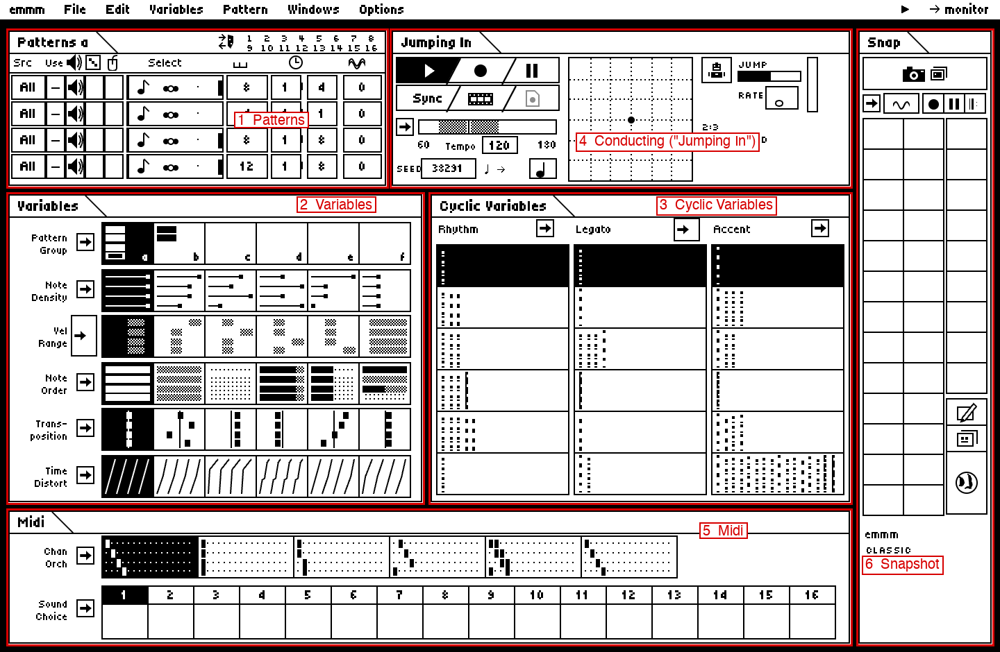

# emmm

**emmm** is a modern recreation and continuation of **M**, the interactive composing and
performing program created at Intelligent Music in 1986–87 by Joel Chadabe, David
Zicarelli, John Offenhartz and Antony Widoff. It runs in the browser and plays your MIDI
hardware through Web MIDI.

> **New to emmm or M? Start with the [Quick Start guide](docs/QUICK-START.md)** — from
> opening emmm to performing with it, step by step.



You give emmm a few notes. It plays them continuously through four Voices, and you shape
*how* they are played — which notes, how often, how loud, how long, how swung, on which
synths — while you listen, by switching between stored settings, "conducting" with the mouse,
recalling Snapshots or playing a MIDI keyboard. It is not a generic generative sequencer: it
reproduces M's own model — Patterns, Voices, Variables with six Positions, Cyclic Variables,
conducting, Hold/Do, Snapshots and Slideshows — and M's dense 1-bit control-panel look.

## Run it

You need [Node.js](https://nodejs.org/) 20.19 or newer (22 LTS recommended). In the emmm
folder:

```bash
npm install
```

```bash
npm run dev
```

Open <http://localhost:5199> in Chrome, Edge, Opera or Firefox and allow MIDI access when
asked. Safari has no Web MIDI; emmm still runs there, playing through its small internal
monitor sound.

Other commands:

```bash
npm test
```

```bash
npm run build
```

`npm run build` writes a static site to `dist/` that works from any folder of any static web
server (Web MIDI needs `https` or `localhost`).

## The hosted version (GitHub Pages)

emmm is a static site, so it can be served by GitHub Pages at
`https://<username>.github.io/<repository>/` — for example `https://<username>.github.io/emmm/`.
It needs no server, accounts or cloud storage: everything runs in your browser, your work is
kept in the browser's local storage and in files you download, and MIDI goes only between the
browser and your MIDI devices. There is no analytics, telemetry or tracking.

### Deploying

The workflow in [.github/workflows/pages.yml](.github/workflows/pages.yml) runs on every push
to `main` (or by hand from the Actions tab). It installs exactly what `package-lock.json`
lists, runs the tests and the type check, builds the site for the repository's path and
deploys it. If any step fails, nothing is deployed.

The published emmm lives at <https://emmm.allmyfriendsaresynths.com/>. Because the repository
has a `CNAME` file (a custom domain), the workflow builds for the domain root (`/`); without
one it builds for `/<repository>/`.

One-time setup:

1. Push this repository to GitHub (the repository name becomes the URL path, e.g. `emmm`).
2. On GitHub, open **Settings ▸ Pages** and set **Source** to **GitHub Actions**.
3. Push to `main` (or run the workflow from **Actions**). The deploy step prints the site's URL.

To try the GitHub Pages build locally:

```bash
npm run build:pages
```

```bash
npm run preview:pages
```

then open <http://localhost:4173/emmm/>. (These two scripts assume the path `/emmm/`; the
workflow uses the actual repository name automatically.)

## First steps

1. **Start** (Space, or ▶ in the Conducting window). The demo document "Jumping In" plays
   four Voices.
2. Click Positions in the **Variables** and **Cyclic Variables** windows while it plays.
   Double-click a Position to open its edit window; edits are heard immediately.
3. **File ▸ Midi Assignment…**: choose your MIDI device for the 16 output channels ("All
   outputs →" sets them all at once).
4. **Chan Orch** (Midi window) decides which output channels each Voice plays on.
5. Double-click a Voice's **Select** box (Patterns window) to open the **Pattern Editor** and
   click in notes — or set the Voice's **Use** to **R** and play into it from a MIDI keyboard.
6. **Snapshots**: press Hold/Do (camera, or Backspace), click some Positions, then type a
   letter A–Z to store them. Type the letter again later to recall them.
7. **File ▸ Save** downloads a `.emmm.json` document; **Open…** loads one. Work is also
   autosaved in the browser.

The [Quick Start](docs/QUICK-START.md) explains all of this properly, and **emmm ▸ Help…**
in the app has a summary and a link to it.

URL options: `?demo` loads the demo, `?new` an empty document, `?seed=12345` sets the seed.

## Status

The Classic engine and interface are functional: all of M's Variables and Cyclic Variables,
Time Distortion, conducting (including continuous conducting and the Robot Conductor),
Hold/Do, Snapshots, Slideshows, the Input Control System, recording modes, the Pattern Editor
and menus, Movies (MIDI file export), MIDI file import (into Patterns or as a play-along
Sequence), Web MIDI input and output with timestamped scheduling, save/load and seeded
randomness. 122 automated tests (including a seeded fuzz test and worked examples) cover the
engine, timing maths, persistence, session logic and Extended features.

**Extended** (Options ▸ Extended…, off by default) explores what M might have become: MIDI
clock input, MIDI Learn for controllers, and CC Cycles. It never changes how Classic generates
notes.

Still to do: checking emmm against the original program in an emulator — several behaviours
are reasoned from documentation; see [docs/UNCERTAINTIES.md](docs/UNCERTAINTIES.md) and
[docs/ROADMAP.md](docs/ROADMAP.md).

## About this project

emmm is an **unofficial**, independent recreation. It is not affiliated with or endorsed by
Intelligent Music, Cycling '74, David Zicarelli, or M's other original developers or rights
holders.

- **M is the design reference.** emmm aims to be faithful to M's concepts, behaviour,
  workflow and look; fidelity to M is one of its main goals.
- **The implementation is independently written.** No program code from M was used.
- **No original M material is distributed.** The repository and the hosted site contain no M
  binaries, disk images, bitmaps, fonts or manuals; the interface is redrawn with new
  HTML/CSS/SVG.
- **The historical sources** used to reconstruct M's behaviour — chiefly the M 2.7 manual and
  David Zicarelli's 1987 *Computer Music Journal* article — are listed in
  [docs/PROVENANCE.md](docs/PROVENANCE.md), with notes on what each was used for.

The same note appears in the app under **emmm ▸ About emmm…**.

## Documentation

* [docs/QUICK-START.md](docs/QUICK-START.md) — **start here**: learn to make music with emmm
* [docs/RESEARCH.md](docs/RESEARCH.md) — what we learnt about M, and from where
* [docs/M-BEHAVIOUR.md](docs/M-BEHAVIOUR.md) — the reconstructed behavioural specification
* [docs/EXAMPLES.md](docs/EXAMPLES.md) — worked input → output examples (also tests)
* [docs/ARCHITECTURE.md](docs/ARCHITECTURE.md) — how emmm works
* [docs/UNCERTAINTIES.md](docs/UNCERTAINTIES.md) — what still needs checking against M
* [docs/ROADMAP.md](docs/ROADMAP.md) — remaining Classic work and Extended ideas
* [docs/PROVENANCE.md](docs/PROVENANCE.md) — sources and licensing notes
