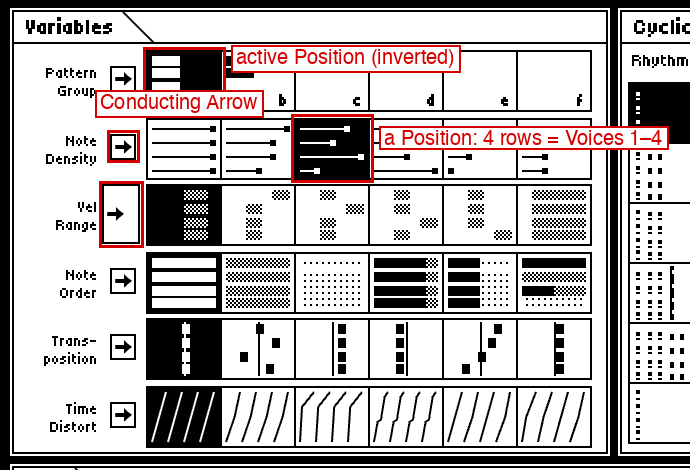
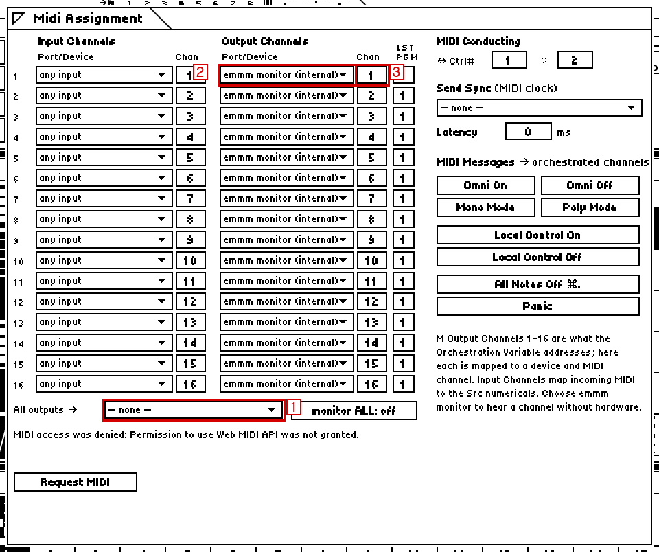
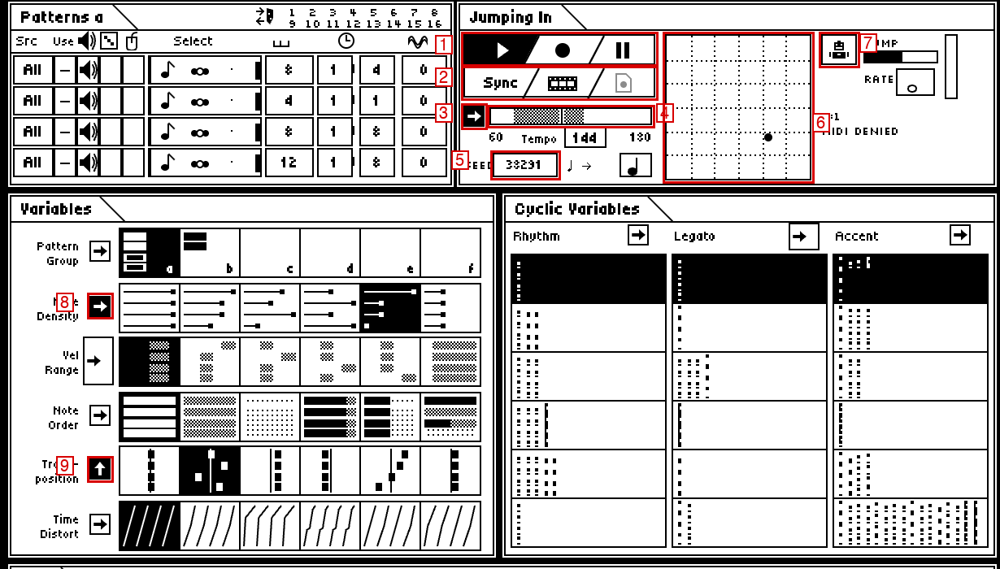
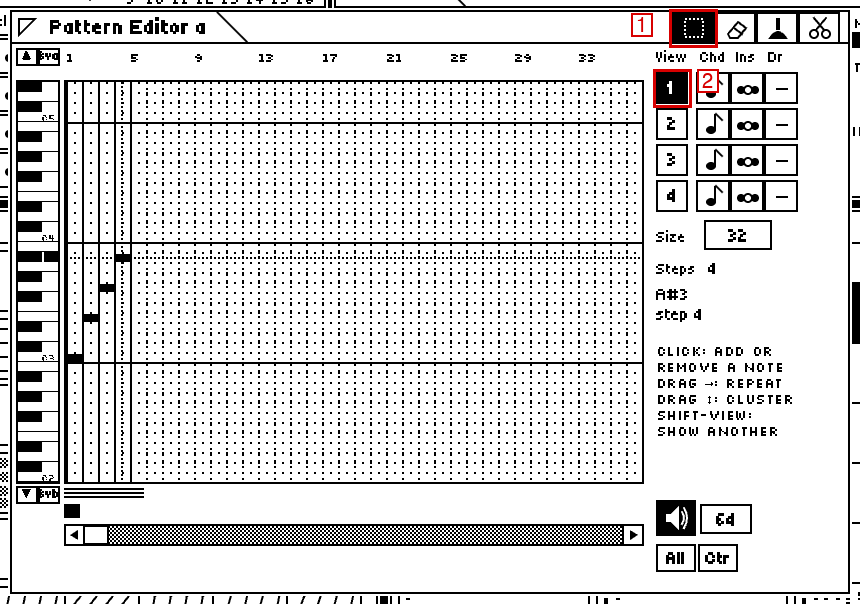
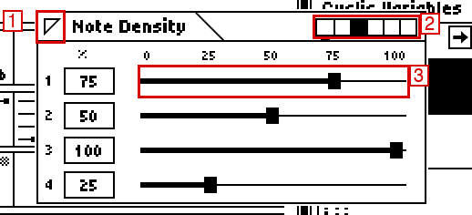
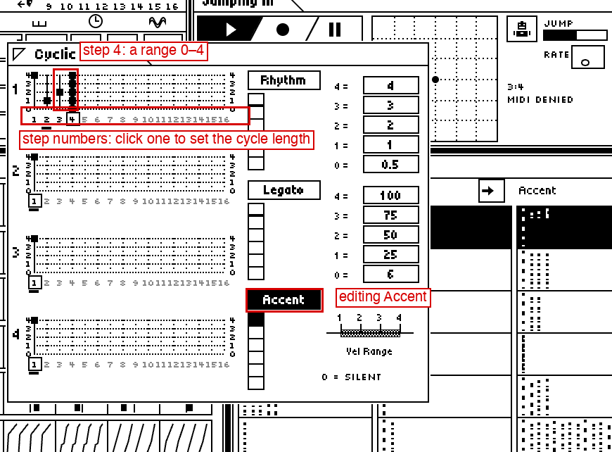
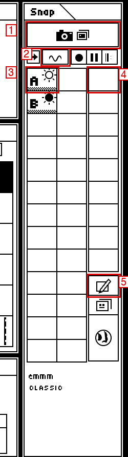

# emmm Quick Start

This guide gets you from opening emmm to performing an evolving, interactive MIDI piece.
It assumes you know MIDI, synths and sequencers, and that you have never used M.

All screenshots are of the current emmm build. Red boxes and numbers were added afterwards
to point at things; nothing else in them has been edited.

---

## What emmm actually does

emmm is a modern recreation of **M**, an "intelligent instrument" released by Intelligent
Music in 1986–87 (designed by Joel Chadabe, David Zicarelli, John Offenhartz and Antony
Widoff). M was built for composing *and* performing at the same time: you give it some
musical material, it plays that material continuously, and you shape *how* it is played
while you listen.

The material is deliberately simple. A **Pattern** is just a list of notes and chords in
order — no timing, no lengths, no velocities. "C3 E3 G3 B♭3" is a perfectly good Pattern.
emmm has four of them running at once, and each one becomes a **Voice**: a stream of MIDI
notes on its way to your synths.

Between the Pattern and the MIDI output sits a fixed chain of transformations, which M calls
**Variables**:

```
Pattern ─► Voice ─► Variables ──────────────────► Cyclic Variables ─────► MIDI
 notes,     one per  which notes (Note Order),      Rhythm  (time to next) Orchestration
 chords,    Pattern  how many (Note Density),       Legato  (note length)  (which channels)
 rests               how high (Transposition),      Accent  (how loud)     Sound Choice
                     how loud overall (Vel Range),                         (program changes)
                     how it swings (Time Distort)
```

Each Variable is always doing *something*, and each has **six stored alternative settings**
(called **Positions**). Making music in emmm mostly means switching between those Positions,
editing them, and setting up ways to switch many of them at once — by "conducting" with the
mouse, with Snapshots, or from a MIDI keyboard.

So emmm is **not a step sequencer**. You will not draw a bar of drums note by note and hear
it back exactly. You enter a few notes, and then decide how freely they are re-ordered,
thinned out, accented, lengthened, swung and transposed — and those decisions are themselves
the instrument you play. Some of the decisions are random within limits you set: rhythm,
articulation and accent can each be "pick from this range each time". The result is music
that is recognisably *yours* but never quite the same twice — unless you want it to be.

---

## The six areas of the screen


1. **Patterns** (top left) — one row per Voice (1–4 from top). The columns, left to right:
   input channel (**Src**), what incoming MIDI does (**Use**), the speaker (**Play-Enable**:
   is this Voice heard?), a ✓ column (echo your playing through this Voice's channels), a ◆
   column (Mouse Advance), the **Select** box (click to select the Pattern; double-click to
   edit it), **Output Length** (how many of its steps are played), **Time Base** (two boxes,
   e.g. `1 | 4` = quarter notes) and **Phase** (a delay in ticks; 96 = a quarter note).
2. **Variables** (middle left) — six rows: Pattern Group, Note Density, Vel Range, Note
   Order, Transposition, Time Distort. Each row has an arrow box and six **Positions**.
3. **Cyclic Variables** (middle) — Rhythm, Legato and Accent, each with six Positions
   stacked vertically.
4. **Conducting** (top middle, titled with the document's name — "Jumping In" for the demo)
   — transport, tempo, the random **seed**, and the square **Conducting Grid**.
5. **Midi** (bottom) — **Chan Orch** (Orchestration: which output channels each Voice plays
   on) and **Sound Choice** (16 sets of program changes).
6. **Snapshot** (right, titled "Snap") — the Hold/Do button, 26 Snapshots (A–Z) and 9
   Slideshows.

How to read the little pictures: every Position box shows **four rows, one per Voice**
(Voice 1 at the top). The **active** Position — the one you are hearing — is drawn
**inverted** (white on black).



---

## Your first 5 minutes

Use the included demo document, **Jumping In**: four Voices playing a scale, slow chords,
a bass line and a sparse high line, with every Variable on Position 1 (a "neutral" setting).

1. **Launch emmm.** In a terminal, in the emmm folder:
   ```bash
   npm run dev
   ```
   Open <http://localhost:5199> in **Chrome** (or Edge or Opera; Firefox also has Web MIDI).
   When the browser asks to let the site use your MIDI devices, choose **Allow**. If emmm
   does not open on Jumping In (it reopens whatever you had last), choose **File ▸ Open
   Demo**.

2. **Start playback.** Press **Space**, or click **▶** — the leftmost part of the
   top strip in the Conducting window. The ▶ part turns black while playing. (In M the
   middle **●** is **Stop**, not record; the right one, **❚❚**, is Pause.)

3. **Hear and see what it is generating.** Look at the top-right corner of the menu bar:
   `→ monitor` means emmm is playing through its small built-in sound (used when no MIDI
   device is chosen or available); `→` followed by a device name means it is going to that
   MIDI port. To *see* the notes, choose **emmm ▸ Monitor**: a window lists each Voice's
   current step, pitches and velocity, and every outgoing note. The **Pattern Group** box
   with an inverted "a" also flashes a little brick each time a Voice's Pattern starts over.

4. **Select a real MIDI output.** Choose **File ▸ Midi Assignment…**. Under the table, open
   the **All outputs →** menu (1 in the picture) and pick your interface or synth. All 16
   rows of **Output Channels** now point at that port, with MIDI channels 1–16 in order.
   The menu-bar indicator changes to that port's name. Close the window with the triangle
   at its top-left corner.

   

5. **Route Voice 1 to MIDI channel 1.** It already is, in two layers:
   - The **Orchestration** Variable sends each Voice to one or more *M Output Channels*. In
     the Midi window, the inverted (active) box in the **Chan Orch** row shows four rows of
     sixteen dots; in Position 1 each Voice has one filled square: Voice 1 on channel 1,
     Voice 2 on 2, and so on. Double-click that box to see it large: Voice 1's row has its
     first square hatched.
   - **Midi Assignment** then maps each M Output Channel to a real port and MIDI channel
     (row 1 → your port, Chan 1).

6. **Connect a hardware synth.** Set your synth to receive on MIDI channel 1. To hear only
   Voice 1 on it, click the speaker icons of Voices 2–4 in the Patterns window so they
   disappear (click again to bring them back). A multitimbral synth or several synths on
   channels 1–4 will play all four Voices.

7. **Change something simple and hear it immediately.** Press the mouse in the **top half**
   of the **Tempo** box (the number `120` in the Conducting window): the tempo rises by one,
   and keeps rising while you hold. The bottom half lowers it. Or press in the box and drag
   the mouse up or down *outside* it — the cursor hides and the number slides. This is
   M's **numerical**, and every number box in emmm works this way.

8. **Change Pattern Group.** In the Variables window, top row (**Pattern Group**), click the
   box marked **b**. All Voices restart from their first note with a different set of
   Patterns: Voice 1 now arpeggiates C3 E3 G3 B3 and Voice 2 plays two chords; Voices 3 and
   4 are silent because group b has no material for them. Click **a** to go back.

9. **Change Note Density.** Click the **second** box of the **Note Density** row. Each of the
   four little lines shows a Voice's chance of sounding: Voice 1 stays at 100%, the others
   drop to 75%, 75% and 50%, and their lines get shorter. Now click the **sixth** box: every
   Voice plays only about a third of its notes — the music thins into fragments while still
   keeping its pulse, because skipped notes become rests. Click the first box to restore.

10. **Change Note Order.** Click the **second** (grey) box of **Note Order**: the scale is
    re-ordered into a new melody which then *repeats* every eight notes (**Cyclic
    Random**). Click the **third** (dotted) box: notes are picked at random every time
    (**Utterly Random**) — the same pitches, never the same tune. The **fourth** box is
    mostly the original order with occasional substitutions. Back to the first.

11. **Change Transposition.** Click the **second** box of **Transposition**: Voice 2 jumps
    up an octave, Voice 3 down an octave, Voice 4 up a fifth (Voice 1 stays). In the little
    picture, a brick to the right of the centre line means "up". Click the **third** box:
    everything up a fourth. Back to the first.

12. **Change Rhythm.** In the Cyclic Variables window, **Rhythm** column, click the
    **second** box: each Voice now plays *long–short–short* (a full beat, then two half
    beats) instead of an even pulse. The **third** box gives *long (×2)–short–short*. Back
    to the first.

13. **Change Accent.** In the **Accent** column, click the **second** box: every fourth note
    is accented (*strong–weak–weak–weak*), and since that four-step accent cycle runs
    against Patterns of 8, 4, 8 and 12 steps, the strong beats fall on different notes in each
    Voice. The **fifth** box (4, 0, 2, 3) contains a 0, which is a rest — hear the hole.
    Accents only make a difference if your synth sound responds to velocity.

14. **Use the Conducting Grid.** Click the small arrow box to the left of the **Note Density**
    row (8 in the picture below). It turns black: Note Density is now "conducted". Press the
    mouse inside the dotted square in the Conducting window (6) and drag left and right. As
    the dot (the **Baton**) crosses the six columns, Note Density switches between its
    Positions 1–6 — watch the inverted box move along the row. Now press and **hold** the
    arrow box next to **Transposition** (9): after a moment it starts rotating → ↓ ← ↑;
    release when it points **up** (it is enabled and turns black). Drag the Baton up and
    down too: one gesture now changes two things.

    

15. **Stop safely.** Press **Return**, or click **●** (the middle of the top transport strip).
    Stop sends note-offs for everything that is sounding. (**Tab** is *Pause*: it freezes
    the music and deliberately leaves held notes sounding, as M did — press Tab or Space to
    continue.) If a note ever hangs, press **⌘.** (All Notes Off), or use **Panic** in
    File ▸ Midi Assignment… .

At this point you have heard the whole idea: *the notes never changed — everything you
did changed how they were performed.*

---

## Build something from scratch

One external synth on MIDI channel 1. Use a sound that responds to velocity and can
sustain (an electric piano or a soft synth patch is ideal).

### 1. A new document

Choose **File ▸ New** and confirm. You get empty Patterns, only Voice 1 enabled, and every
Variable on Position 1. (Your MIDI routing from the previous step is kept.)

### 2. Enter four notes

Double-click Voice 1's **Select** box (the box with ♪ ●● · in the first row of the Patterns
window). The **Pattern Editor** opens.



Pitch runs vertically (a keyboard on the left, with C2, C3, C4… marked in tiny letters);
**steps** run left to right. As you move the mouse over the grid, the right-hand panel shows
the note and step under the cursor. emmm, like M, calls **MIDI note 60 "C3"**.

Click once in each of these cells: **step 1 at C3, step 2 at E3, step 3 at G3, step 4 at
A#3** (B♭ is shown as A#). Each click adds a note (clicking a note again removes it).

Now close the Pattern Editor with the triangle at its top-left corner (it covers part of
the Patterns window).

> **What you changed:** a four-step Pattern, a C7 arpeggio.
> **Musically:** this is all the pitch material emmm will use for now. Everything else is
> performance.

### 3. Hear it loop

Press **Space**. Voice 1 plays C E G B♭ in even quarter notes, forever. The Patterns window
shows **Output Length 4** and **Time Base 1 | 4**. Change the right-hand Time Base number
from 4 to **8** (press the top half of that box four times: 5, 6, 7, 8): twice as fast. Set
it back to 4.

> A Pattern always loops, because it is not a timeline — it is a *pool of material* that the
> Voice walks through.

### 4. Pattern Groups: a second chord

Voice 1's **Select** box should be black
(selected) — double-clicking it to open the editor also selected it. If it is white, click
it once. Choose **Edit ▸ Copy**. In the Variables window click Pattern Group **b**
(silence: group b is empty). With the Select box still black, choose **Edit ▸ Paste**.
Now choose **Pattern ▸ Transpose Up Half-Step** five times: group b's copy becomes F A C E♭.

Click **a**, then **b**, then **a**…: you are switching between C7 and F7. Each switch
restarts the Voices from their first step, so the change lands cleanly.

> Pattern Groups are six complete sets of four Patterns — think "sections" or "chords" you
> can jump between.

### 5. Note Density: thinning

Double-click the **second** Note Density box. Two things happen: Position 2 becomes the
active one (a double-click is also a click), and the **Note Density** edit window opens on
it. The six small boxes at the right of its title bar show which Position you are editing —
the black one.



Drag Voice 1's slider (the top one) to about **60**: you hear the change *while you drag*,
because you are editing the active Position. About 60% of the notes now sound. Click the
first Note Density box in the main window: all notes again. Click the second: 60% again —
your edit is stored in Position 2.

> **What you hear:** the arpeggio develops gaps, but stays on the beat. **Why it's
> interesting:** density is a texture control — the same line can be busy or sparse with
> one click, and the gaps fall differently every time round.

### 6. Velocity Range: the dynamic window

Double-click the first **Vel Range** box. Each Voice has a range bar between two numbers.
For Voice 1, press near the left of the bar and drag to the right: you draw a new range.
Draw roughly **30 to 110**. With every Accent at level 4 (the default), every note plays at
the *top* of this range (110). Now draw a narrow range around 50: everything gets quieter.
Set it back to about 30–110; it will matter in step 11.

### 7. Note Order: the same notes, a different melody

Click the second Note Order box (grey picture): C E G B♭ becomes a new fixed order that
repeats. Click the third (dotted): every note is chosen at random. Now double-click the
**fourth** box (it becomes active and its edit window opens): each Voice has a bar that is
black (Original order), grey (Cyclic Random) and dotted (Utterly Random), with the three
percentages beside it. For Voice 1, drag the boundary between black and grey to the left
until the first number reads about 70: mostly the arpeggio, with occasional surprises.

> With only four notes, Utterly Random sounds like improvising on a chord. With a longer
> scale it becomes melodic wandering. Cyclic Random is a *fixed* variation — repeatable, so
> it can be a "B" melody. **Pattern ▸ ReScramble** (with the Pattern selected) deals a new
> one.

### 8. Transposition

Double-click the **sixth** Transposition box: it becomes active (all Voices +2, so you hear
the arpeggio on D) and its edit window opens. Each Voice has a **Note** box and an **Octave**
box; C3 means "no transposition". Press the top half of Voice 1's Note box until it reads
**G** (octave 3): the arpeggio moves up a fifth as you click. Now alternate between the first
and sixth Transposition boxes in the main window: instant modulation, played *in time*.

### 9. Time Distortion: swing and rubato

First set Voice 1's Time Base to **1 | 8** (step 3). Click the **second** Time Distort box:
eighth notes now **swing** — the map stretches the first half of each beat and squeezes the
second. Click the **third** box: over an eight-beat cycle the notes rush and then slow down
dramatically, then start again.

Double-click the first Time Distort box to see the editor: a square with a dotted diagonal.
The horizontal axis is real time; the vertical axis is the Voice's own clock. Click a point
to start a new map, click more points up and to the right, and double-click near the
top-right corner to finish. Where your line is steep the notes crowd together; where it is
flat they spread out. **Clear** removes Voice 1's map.

> Unlike a swing knob, this bends *any* stretch of time — a beat, a bar, eight bars — while
> keeping the total length the same, so the Voice still meets the others on the downbeat.

### 10. Rhythm

Click the second **Rhythm** box: *long–short–short*. Now open the **Cyclic Editor** by
double-clicking the first Rhythm box (this also makes Position 1 active again) (see "Cyclic Variables" below for how its grids work).
In Voice 1's grid (the top one), click step number **3** below the grid to make a 3-step
cycle, then click **step 3 at level 0**. Level 0 is "half a pulse", level 1 a whole pulse:
you hear *long–long–short*. Four notes against a three-step rhythm: the arpeggio and the
rhythm realign only every twelve notes.

### 11. Legato and Accent

In the Cyclic Editor click the **Legato** button. Make Voice 1's cycle 4 steps long and set
levels **1, 1, 1, 4**: three short notes and a long one (level 1 = 25% of the time to the
next note, level 4 = 100%). Then click **Accent**, set a 4-step cycle **4, 1, 2, 1**: with the
30–110 Velocity Range you set, you get 110, 30, 57, 30.

> Now the four notes have *phrasing*: short, short, short, long — loud, soft, medium, soft —
> while Note Order, Rhythm and Accent cycle independently.

### 12. Orchestration

Double-click the first **Chan Orch** box. Voice 1's row has square 1 hatched. Click square
**2** as well: Voice 1 now plays on output channels 1 *and* 2 — if a second synth listens on
channel 2 you get a layered sound. Click square 1 to remove it, and Voice 1 moves entirely to
channel 2. Put it back on 1 only.

> Orchestration is a Variable too — with six Positions. You can store "everything on one
> synth", "each Voice on its own synth", "everything doubled" and switch between them while
> playing; notes already sounding are not cut off.

---

## The big M concept: Positions

Every Variable (except Sound Choice, which has sixteen) holds **six Positions**. A Position is
a complete setting of that Variable **for all four Voices at once**. Think of each Variable as
a small rack of six presets: Note Density Position 3 might be "Voice 1 dense, Voice 4 nearly
silent"; Position 5 "everything sparse".

Precisely how it behaves:

- **Exactly one Position per Variable is active.** It is drawn inverted, and it is what you
  hear.
- **Clicking a Position makes it active immediately** (at the next note of each Voice).
- **Double-clicking makes it active and opens its edit window** on that Position. The six small boxes at the
  right of the edit window's title bar choose *which* Position you are editing: the **black**
  box is the one being edited; the **active** one has a short line under it. Click another
  box to edit a different Position without changing the sound. **Option(Alt)-click** a box to
  edit it *and* make it active.
- **Editing the active Position changes the music as you drag.** Editing an inactive one is
  silent preparation — set up the next section while the current one plays.
- **Drag a Position onto another** to swap them; **Option(Alt)-drag** to copy. Use this to
  arrange Positions so that left-to-right makes musical sense — that matters for conducting.
- Pull *down* on one of an edit window's six small boxes to **mark** it (an asterisk);
  **Options ▸ Locked Marked Variables** then protects marked Positions from editing.

Why six instead of one setting? Because switching is *performance*. A single Note Density
knob can only move one value; six Positions give you six prepared textures, each different
for each Voice, that you can jump between in time, conduct across with one gesture, or store
in Snapshots. Ten Variables × six Positions is an enormous space of combinations, each one a
click away.

---

## Pattern Groups

A **Pattern Group** is a full set of four Patterns — one for each Voice — plus each Pattern's
Output Length, Time Base and Phase. There are six groups, **a** to **f**, and **Pattern Group
is itself a Variable**: its six Positions are the groups. The Patterns window title shows
which one you are seeing (*Patterns a*), and editing always happens in the current group.

The miniature shows the group letter and a **brick for each Voice that has notes**. The
bricks flash when that Voice's Pattern starts over.

Selecting a group **restarts all Voices from their first step** (a Sync). Hold **Option(Alt)**
while clicking to switch without restarting.

Practical example (from the tutorial above): group **a** = a C7 arpeggio, group **b** = the
same Pattern transposed to F7. Conduct Pattern Group across the grid, or store **a** and **b**
in two Snapshots, and you have a chord change you can perform. Because a group also holds Time
Base, group b's Voice 1 could be twice as fast as group a's.

To copy Patterns between groups: select a Pattern (click its Select box), **Edit ▸ Copy**,
choose another group, **Edit ▸ Paste** (the Select box stays selected). Paste copies the
Pattern's Time Base and Phase too; **Edit ▸ Paste Notes** copies only the notes.

---

## Cyclic Variables: Rhythm, Legato and Accent

These three give a Voice its rhythm, phrasing and dynamics. Each Voice has its own **cycle**
for each of them.



Reading the Cyclic Editor (open it by double-clicking any Rhythm, Legato or Accent Position):

- **Four grids**, Voices 1–4 from the top.
- **Steps** are the vertical lines, numbered 1–16 underneath. The boxed number marks the
  **end of the cycle**: **click a number to set the cycle length**. New steps start at
  level 1.
- **Levels** are the horizontal lines, 0 to 4.
- **Click** where a step and a level cross to give that step one level. **Drag vertically**
  on a step to give it a **range** (drawn as a bar): each time the step comes round, emmm
  picks one level from the range at random. **Drag horizontally** to set several steps to
  the same level.
- On the right: the **Rhythm**, **Legato** and **Accent** buttons choose what you are
  editing; the column of six small boxes under each chooses the Position (black = editing;
  Option-click = also make it active).

What the levels mean:

| | Rhythm | Legato | Accent |
|---|---|---|---|
| meaning | time until the next note, in Time Base pulses | note length, as % of the time until the next note | loudness within the Velocity Range |
| level 0 | ×0.5 | 6 % (very short) | **rest** — the note is not played |
| level 1 | ×1 | 25 % | bottom of the Velocity Range |
| level 2 | ×2 | 50 % | ⅓ of the way up |
| level 3 | ×3 | 75 % | ⅔ of the way up |
| level 4 | ×4 | 100 % (values above 100 % make notes overlap) | top of the Velocity Range |

The Rhythm and Legato values are a **global table** (the number boxes `4 =`, `3 =` … on the
right of the Cyclic Editor) shared by every cycle; you can change them. Setting Legato level 4
to `400` gives notes four times as long as the gap — overlapping clouds. Setting Rhythm values
so that several levels are equal "weights" the randomness.

All three cycles step forward **once per note** (rests included), so the **Rhythm cycle sets
the pace** for Legato and Accent.

A concrete example, Voice 1 on 1 | 8 playing C E G B♭:

- Rhythm cycle: **1 1 0 0** (eighth, eighth, sixteenth, sixteenth) — a galloping figure.
- Accent cycle: **4 1 1** — strong every third note, so the accent drifts across the
  four-note pattern and the four-step rhythm.
- Legato cycle: **0–4** on a single step — every note a different length.

Twelve notes go by before pattern, rhythm and accent line up again; the articulation never
repeats.

In the main window the Cyclic Variables boxes show these cycles in miniature: each of the
four rows is a Voice; each little column is a step; the dot's height is the level; a vertical
bar is a range. While playing, the first step of a cycle **blinks** each time that cycle
starts over.

---

## Conducting

Conducting lets one mouse gesture switch many Variables' Positions at once.

1. **Choose what to conduct.** Every Variable has an **arrow box** beside its name (in the
   Variables, Cyclic Variables and Midi windows); Tempo has one left of the tempo bar, and
   Snapshots one at the top of the Snap window. **Click** an arrow box to enable it (it turns
   black); click again to disable.
2. **Choose a direction.** **Press and hold** an arrow box: it rotates → ↓ ← ↑ every half
   second; release at the direction you want. Or press it and drag the mouse around it — the
   arrow points along your drag.
3. **Conduct.** Press inside the **Conducting Grid** and drag. The grid has six columns and
   six rows. For a **→** arrow, the leftmost column is Position 1 and the rightmost Position 6;
   **←** is the reverse; **↑** puts Position 1 at the bottom; **↓** at the top. Tempo is
   continuous: across the grid it sweeps the range drawn in the **Tempo range bar** (drag in
   that bar to draw a range; click once for a single value).

An example performance with Jumping In:

- **Note Density → (horizontal)** and **Tempo → (horizontal)**: moving right changes the
  texture and speeds up together.
- **Transposition ↑ (vertical)**: higher in the grid, higher Positions.
- **Rhythm ↓ (vertical)**: higher in the grid moves Rhythm towards Position 1, lower towards
  Position 6 — so the same vertical gesture trades transposition against rhythmic feel.

Now draw slow circles in the grid. Every crossing of a grid line is a musical event.

Tips:
- Arrange the Positions first (drag to swap, Option-drag to copy) so that neighbouring columns
  are musically related; conducting then feels like a continuous control.
- **Shift-drag** in the grid makes the changes wait for the quantization point (see
  Snapshots).

**Continuous conducting (Velocity Range and Legato).** These two arrow boxes are larger. Press
the **Vel Range** arrow box and drag well away from it (about three box-widths): it changes into
**four small arrows**, one per Voice. Click the narrow strip at the right edge of the box,
beside Voice 1's little arrow: a white "brick" appears. Now dragging the Baton along that arrow
fades Voice 1 smoothly from nearly silent to full, *on top of* its accents. The **Legato** box
in the Cyclic Variables window works the same way and stretches note lengths from ¼× to 4×.
**Option(Alt)-click** in the grid cancels continuous conducting; so does choosing that
Variable's Position by hand.

**The Robot Conductor.** Click the robot button to the right of the grid (7 in the picture
above); it turns black. Under **JUMP**, click or drag in the horizontal bar to set how far the
Baton may jump sideways (full bar = anywhere); the tall thin bar at the far right sets the
vertical jump (near the top = big jumps, bottom = none). **RATE** (the note-value box) sets how
often it may jump — press its top half to go from whole notes towards eighth notes. While the
music plays, the Baton wanders on its own, changing everything you enabled for conducting.
You can still conduct over it.

---

## Snapshots

A **Snapshot** remembers *which Position each chosen Variable is on* (not the Positions'
contents), plus conducting arrows and some Patterns-window settings. Recalling a Snapshot
changes all of those at once. Snapshots are your sections: verse, chorus, breakdown.



**Hold/Do** is the key idea. Normally clicking a Position happens immediately. After you press
**Hold/Do** (the camera button at the top of the Snap window, or **Backspace**), clicks are
*collected* instead: the chosen Positions blink, and nothing changes yet. Then either press
Hold/Do again to make them **all happen together**, or click a Snapshot box to **store** them.

Workflow:

1. **State A.** With music playing, choose some Positions (say Pattern Group a, Note Density 1,
   Rhythm 1).
2. **Store Snapshot A.** Press **Backspace** (Hold/Do starts blinking). Click the active
   Positions you want remembered — they blink. Press **A** on the computer keyboard (or click
   the top-left box of the Snap window). The box now shows an **A with a sun**.
3. **Change several Variables** — Pattern Group b, Note Density 6, Transposition 3,
   Rhythm 2 — by clicking them normally.
4. **Store Snapshot B.** Backspace, click those four Positions, press **B**.
5. **Switch.** Press **A** and **B** on the keyboard (or click their boxes). Shift-A forces a
   restart of all Voices with the change. The sun with a black dot marks the current Snapshot.
   **Restore** (the second icon at the bottom right of the Snap window) undoes the last
   Snapshot.
6. **Quantize.** Press the top half of the box with the wavy line (2): it becomes a whole
   note. Now Snapshots (and Sync, and Shift-clicked Positions) wait for the next whole-note
   boundary counted from Start. Hit **B** slightly *before* the bar line and it lands exactly on
   it.
7. **Make a Slideshow.** A Slideshow records Snapshot changes *and their timing*. With the
   music playing, **Option(Alt)-click** the first box of the right-hand column (4), or press
   **Option-1**: it shows **●1**. Type **A**, wait two bars, **B**, wait, **A**… Press
   **\\** to finish *with a loop* (or **0** to finish without one). Press **1** to play it
   back: emmm performs your structure while you conduct on top. **0** stops a Slideshow.

Also useful: the **globe** (Blink Everything) collects *every* storable control at once — a
"snapshot of everything" — and the **pencil** (Edit Snapshot) re-opens the current Snapshot's
contents as blinking items so you can add or remove some before storing again.

---

## Four Voices

Once one Voice makes sense, add the others. Example hardware setup:

| Voice | Output Channel | Instrument |
|---|---|---|
| 1 | 1 | lead synth |
| 2 | 2 | bass synth |
| 3 | 3 | sampler (pads, textures) |
| 4 | 10 | drum machine |

1. **File ▸ Midi Assignment… ▸ All outputs →** your interface (or set each row's port where
   that instrument is connected; each row's **Chan** box sets the MIDI channel).
2. **Orchestration:** double-click the first **Chan Orch** box. Rows 1–3 already point to
   channels 1–3. In row 4, click square **4** (off) and square **10** (on).
3. **Patterns:** open the Pattern Editor (double-click any Select box) and click **2**, **3**
   or **4** under **View** to edit that Voice's Pattern. For the bass, scroll down with the
   **▼** or **8vb** buttons left of the grid. For drums remember emmm's naming: General MIDI's
   kick (MIDI 36) is **C1**, snare (38) is **D1**, closed hi-hat (42) is **F#1**. A Pattern of
   `C1 F#1 D1 F#1` with a few rests (empty columns) is plenty.
4. **Play-Enable** each Voice (its speaker in the Patterns window) and give each its own Time
   Base: e.g. bass **1 | 4**, lead **1 | 8**, drums **1 | 16**.

How this differs from four sequencer tracks:

- A Voice is **not bound to a channel**. Orchestration is a Variable with six Positions: in
  one Position all four Voices might play the lead synth in unison, in another each has its own
  instrument, in another Voice 1 is doubled on three synths. Switching is instant and notes
  already sounding are not cut off.
- A Voice can go to **several channels**, and several Voices can **merge** onto one.
- Every Variable has **separate settings per Voice** inside each Position, so one click can make
  the drums sparser while the bass gets denser.
- Voices run at **independent Time Bases** — 1|4 against 1|3 against 1|5 is normal, not a
  special mode. Use **Sync** (Space while playing, or the **Sync** button) to realign them.

---

## Saving your work

- **Save:** **File ▸ Save** or **⌘S** downloads a file named after the document
  (`Jumping In.emmm.json`) to your Downloads folder. **Save As…** asks for a new name first.
  The file is plain JSON: Patterns, every Position, tempo, Snapshots, Slideshows, MIDI
  assignment and the seed.
- **Load:** **File ▸ Open…** or **⌘O**, then choose an `.emmm.json` file.
- **Autosave:** emmm saves your current state in the browser a second or two after each change
  and restores it the next time you open emmm in the same browser. It is a safety net, not a
  file — use Save for anything you care about.
- **Browser Library:** **File ▸ Browser Library…** keeps named documents inside this browser
  (type a name, **Save**; select one, **Open**). Useful for sketches; they do not leave the
  browser.
- **Save State As Startup:** **File ▸ Save State As Startup** makes the current setup —
  Positions, routing, options, everything except Pattern contents and Time Distortion maps —
  what **File ▸ New** gives you from now on. **File ▸ Forget Startup State** undoes this.
- **Seeded randomness:** everything random in emmm (density coin flips, random levels, note
  choices, the Robot) comes from a generator started from the **seed** — the number in the box
  labelled SEED in the Conducting window. Every time you press **Start**, the generator restarts
  from that seed, so **the same document, seed and gestures produce the same performance**.
  Keep a seed you like (it is saved in the document); change it (press in the box, or
  **emmm ▸ New random seed**) to hear a different "take" of the same settings.
- **MIDI Movie export:** click the film button (the middle of the lower transport strip in
  the Conducting window; it turns black), press Start, perform, press Stop. Then **File ▸ Save
  Movie As Midi File…** downloads a Standard MIDI File of everything emmm played — ready to
  drop into a DAW.
- **MIDI import:** **File ▸ Open Midi File…** reads a MIDI file into the current Pattern Group
  (one Pattern per chosen channel), or, with **as Sequence**, as a separate track that plays
  along with the four Voices (enable it with the button right of the film button).

---

## Ten things to try

1. **One chord, endless melody.** Four chord tones, Note Order fully **Utterly Random**, Note
   Density about 70%, and a single Rhythm step with the range **0–2**. A line that never
   repeats but never leaves the harmony.
2. **A three against four.** Pattern of four notes, Accent cycle of **three** steps (4 1 1).
   The accent walks across the pattern; add a five-step Legato cycle and the phrasing walks
   too. Three tiny cycles, sixty notes before they all coincide.
3. **Instant canon.** Copy Voice 1's Pattern into Voice 2 (Edit ▸ Copy / Paste with Voice 2's
   Select box selected), send Voice 2 to another synth, and set Voice 2's **Phase** to **48**
   (an eighth note behind) or **96** (a beat behind). Then give Voice 2 Cyclic Random order:
   a canon that drifts into counterpoint.
4. **Anything against anything.** Same Pattern in three Voices with Time Bases **1 | 4**,
   **1 | 5** and **1 | 6**. Press Space to Sync when you want them to meet again.
5. **Ghost notes.** Accent cycle **4, 1–2, 0–2, 1–3** (drag ranges). Some notes vanish (level
   0), some are ghosted, the downbeat is solid. Instant human groove from a straight line.
6. **Overlapping clouds.** Set the Legato value for level 4 to **400** and use a cycle mostly at
   level 4: each note lasts four times the gap, so a single Voice becomes a pad of overlapping
   arpeggios. Try it on a slow-attack sound.
7. **Swing only the drums.** Voice 4 on 1 | 16 with a swing Time Distortion map over an eighth
   note (Length **1 ×** eighth), everything else straight. Then try a two-bar rubato map on the
   lead only — it pushes and pulls against a steady accompaniment.
8. **Let the Robot compose the arrangement.** Enable conducting on Pattern Group (→),
   Orchestration (↑) and Note Density (←). Turn on the Robot with a whole-note rate and modest
   jumps. Sit back: emmm moves between sections, instrumentations and textures on its own.
9. **Two Snapshots, one Slideshow, then improvise.** Store a calm Snapshot A and a busy
   Snapshot B, quantize to whole notes, record a looping Slideshow A-A-B-A. Play it, and
   conduct Transposition by hand on top: structured and free at once.
10. **The MIDI keyboard as conductor.** Set a Voice's **Use** column to the **♯♭** icon (press
    the "–" box in the Use column, slide right to ♯♭, release): every key you play transposes
    that Voice, C3 = no change. Play chord roots with your left hand and emmm becomes an
    accompanist that follows you. (Set **Use** to **C** instead and your keyboard becomes a
    remote control: middle C starts, B2 stops, B3 is Hold/Do.)

---

## Cheat sheet

**Flow:** Pattern (notes) → Voice → Variables (which notes, how many, how high, how loud,
how timed) → Cyclic Variables (rhythm, length, accent per note) → Orchestration → MIDI.

**Words**

| Term | Means |
|---|---|
| Pattern | an ordered list of notes, chords and rests; no timing |
| Pattern Group | a set of four Patterns (a–f), one per Voice; itself a Variable |
| Voice | one of four parallel streams that plays a Pattern |
| Variable | one transformation (Note Density, Transposition, …) |
| Position | one of a Variable's six stored settings (four Voices each); one is active |
| Snapshot | a remembered combination of active Positions (A–Z) |
| Slideshow | a recorded, timed sequence of Snapshot changes (1–9) |

**Variables**

| Variable | Changes |
|---|---|
| Pattern Group | which set of four Patterns plays (restarts the Voices) |
| Note Density | chance each note sounds (skipped notes become rests) |
| Vel Range | lowest–highest velocity a Voice can play |
| Note Order | Original / Cyclic Random (repeating) / Utterly Random mix |
| Transposition | semitones up or down, relative to C3 |
| Time Distort | swing / rubato map over a chosen length |
| Rhythm | time to the next note: level 0–4 → ×0.5, ×1, ×2, ×3, ×4 the Time Base |
| Legato | note length: 6 %, 25 %, 50 %, 75 %, 100 % of the gap |
| Accent | 0 = rest, 1–4 = low → high within the Vel Range |
| Chan Orch | which output channels each Voice plays on |
| Sound Choice | 16 sets of program changes, sent when chosen |

**Keyboard**

| Key | Does |
|---|---|
| Space | Start; while playing, Sync |
| Return | Stop (notes off) |
| Tab | Pause / continue (notes held) |
| Backspace | Hold/Do |
| A–Z | recall Snapshot (store it while holding); Shift = with Sync |
| 1–9 / Option-1–9 | play / record Slideshow |
| 0 · \\ · Option-\\ | stop Slideshow · loop point · remove loop |
| Caps Lock, or ⌘⌥ + move the mouse | Mouse Advance (Voices with ◆ step only while the mouse moves) |
| ⌘. | All Notes Off |
| ⌘S · ⌘O · ⌘0 | Save · Open · close edit windows |
| ⌘M | metronome on/off |

**Mouse**

| Gesture | Does |
|---|---|
| click a Position | make it active |
| double-click a Position | edit it |
| drag a Position onto another / Option-drag | swap / copy |
| Shift-click a Position | change at the next quantization point |
| number box: top half / bottom half / drag outside | up / down / slide |
| Shift-click a number box | copy the last value you set in any number box |
| range bar: drag / click | draw a range / one value |
| arrow box: click / hold / drag around | enable / rotate / point |
| Option-click in an edit window's six boxes | edit that Position and make it active |
| Select box: click / double-click | select Pattern (for menus) / open Pattern Editor |
| Use box: press, slide, release | choose what MIDI input does for this Voice |

Full help is also in the app: **emmm ▸ Help…**. Background and the behaviour reference:
[M-BEHAVIOUR.md](M-BEHAVIOUR.md), [RESEARCH.md](RESEARCH.md).
